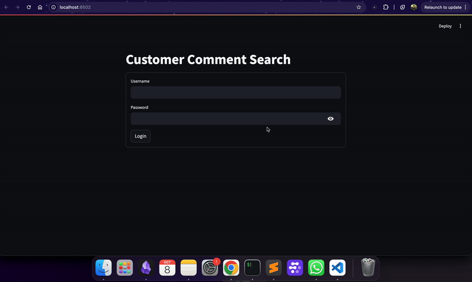

# S3-DynamoDB-AOSS-TF


## New features added in this branch:
<p align="center">
  
</p>

- **GUI**
    - Added GUI for the comment's search using streamlit.
    - Command `streamlit run gui-search-script.py [OpenSearch host URL]`
- **Automated the CI/CD workflow**
    - Using `GitHub Actions`, automated the CI/CD workflow for Terraform to manage infrastructure changes with AWS integration.
    - On every push and pull request, the action will be triggered.
    - The github action workflow can be found in `.github/workflows/deploy.yml`
    - A dedicated S3 bucket and a dynamodb table is used to manage the tfstate remotely.
- **Security Practices**
    - Unlike assigning the variable in a static way, `secrets.tfvars` is used locally and `Github secrets` are used for remote deployment.

---

### To run this locally (since we are using the secrets.tfvars)

```
terraform init
terraform plan -var-file="secrets.tfvars"
terraform apply -var-file="secrets.tfvars"
terraform destroy -var-file="secrets.tfvars"
```

---